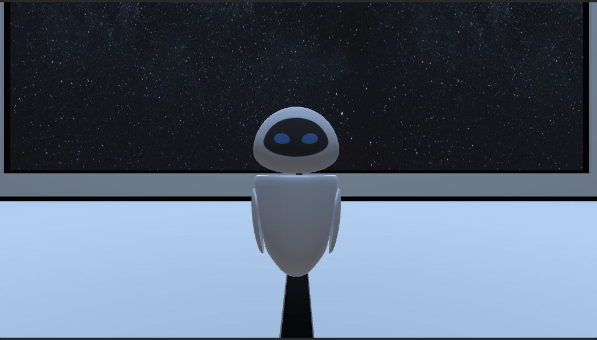

# Intro to Game Design Assignment 1 and 2

## Assignment 1
We were required to build an environment in Unity and to create a character from scratch or download a model from the internet. Then, we had to implement player controls.

## Assignment 2
We were required to make animations and add sounds and lights.

## Image

## YouTube Video
[https://youtu.be/jykL7AF9Cdk](https://youtu.be/jykL7AF9Cdk)
